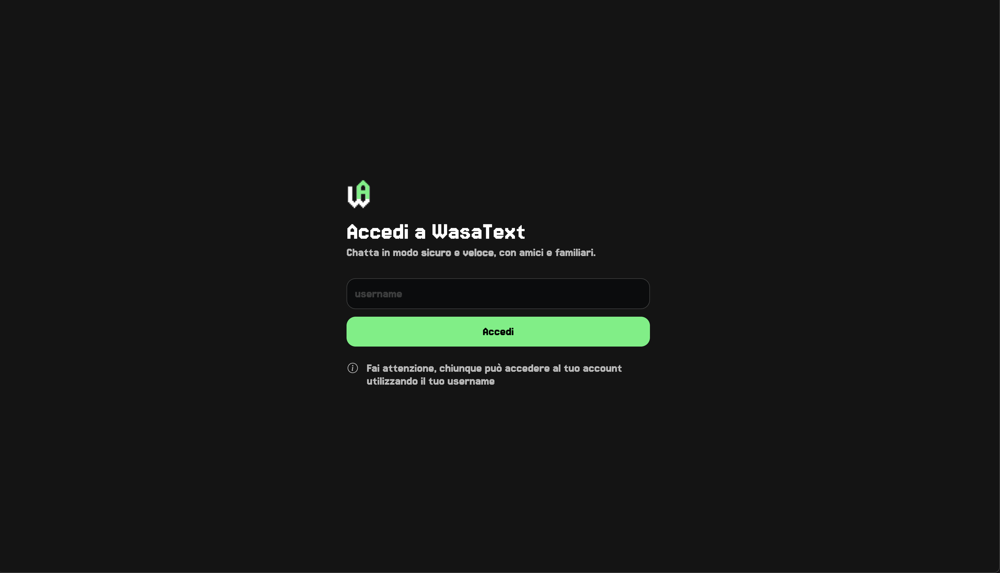
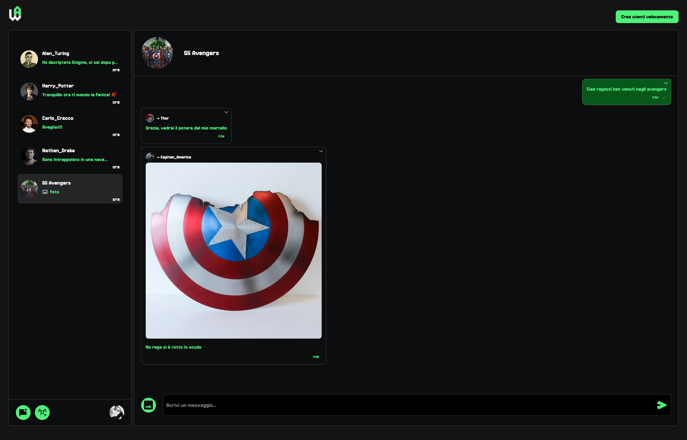
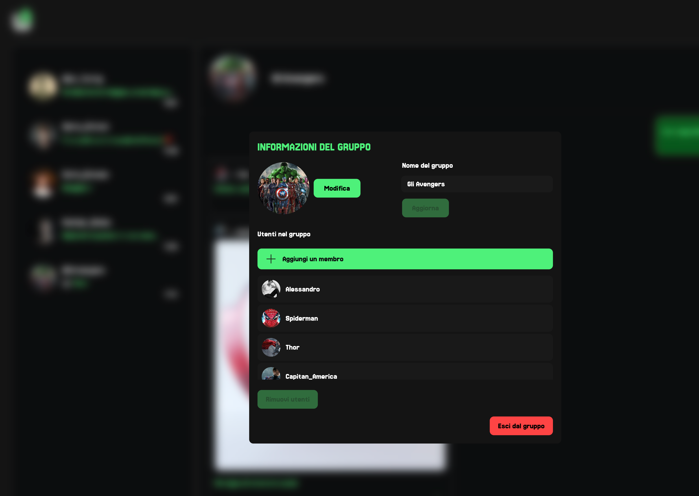
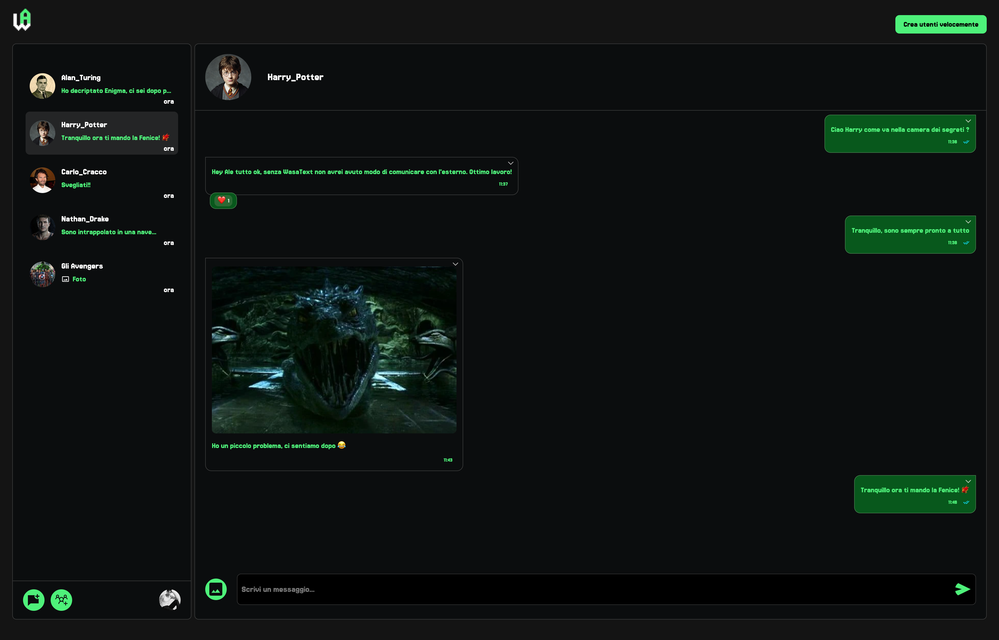

# WasaText

WasaText is a real-time chat application inspired by WhatsApp.
It features a Go-based REST API backend and a Vue.js frontend for a smooth, responsive chatting experience.

<table style="width:100%; border-collapse:collapse;">
  <tr>
    <td style="padding:0;">
      
    </td>
  </tr>
  <tr>
    <td style="padding:0;">
      
    </td>
  </tr>
  <tr>
    <td style="padding:0;">
      
    </td>
  </tr>
  <tr>
    <td style="padding:0;">
      
    </td>
  </tr>
</table>


## 🏗️ Tech Stack

Backend: Go (REST API)
Frontend: Vue.js (Vite)
Containerization: Docker + Docker Compose

## 📁 Project Structure

```
cmd/
  └── webapi/        # Go backend executable
doc/                 # API documentation (OpenAPI)
webui/               # Vue.js frontend application
Dockerfile.backend   # Backend Docker configuration
Dockerfile.frontend  # Frontend Docker configuration
docker-compose.yml   # Multi-container setup
```

## 🚀 Development Setup

1. **Start the Backend**

```
go run ./cmd/webapi
```

Backend runs on http://localhost:3000

2. **Start the Frontend**

```
./open-node.sh
# inside container
yarn run dev
```

Frontend runs on http://localhost:5173

(Alternatively, you can run yarn dev locally if Node.js is installed.)

## 🐳 Running with Docker (Recommended for Production)

You can easily run both backend and frontend using Docker Compose.

**Build and Start Containers**

```
docker-compose up --build
```

Backend: http://localhost:3000
Frontend: http://localhost:80

**Stop Containers**

```
docker-compose down
```

## 📘 API Documentation

API documentation can be found in the doc/ directory.

## 📝 License

See LICENSE file.
